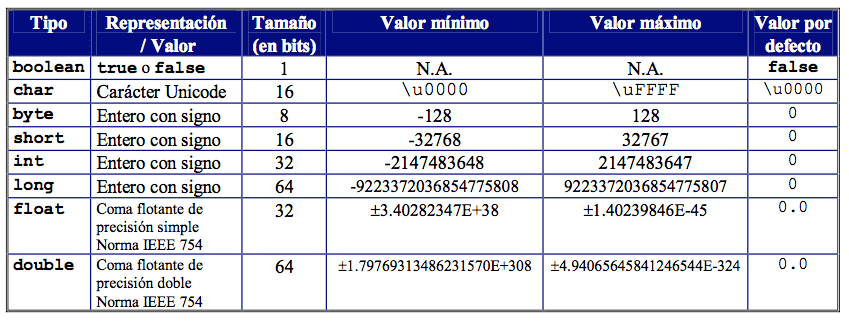

 <h1>Las variables</h1>
  Una variable es una porción de memoria a la que se le asigna un nombre (identificador) y es capaz de almacenar un valor que podrá ser utilizado a lo largo del programa (siempre dependiendo de los modificadores y el contexto del mismo). Además, su valor puede ser modificado en cualquier momento para que pueda ser incrementada, decrementado o simplemente reutilizada.

Hay una serie de restricciones a la hora de elegir un nombre para una variable. Fuera de esas restricciones se puede escoger cualquier combinación de caracteres válidos, pero se recomienda siempre elegir un identificador que describa el valor o el uso que se hará de dicha variable:

- No puede comenzar por ningún digito
- Puede contener cualquier letra o digito
- No puede contener ningún caracter especial (signos de puntuación, . . .) a excepción de los caracteres _ y $
- No puede contener espacios
- A continuación se muestran algunos identificadores válidos en Java:
````
fechaNacimiento 
color 
ciudad_nacimiento 
_nombre 
DireccionPostal
cantidadproducto 
cadena$Texto
````
<h2>Nombres de las variables</h2>
Además, Java dispone de una guía de estilo que define algunas recomendaciones que se pueden unir a estos requisitos, de forma que facilite la lectura Java con la idea de hacer el código de una aplicación más mantenible y reutilizable:

- Los identificadores de variable deberán comenzar siempre es minúsculas
- Si un identificador está compuesto de más de una palabra, a partir de la segunda comenzarán en mayúscula y se escribian una seguida de otra

Así, siguiendo las recomendaciones, los anteriores identificadores (todos ya válidos) deberíamos escribirlos de la siguiente forma:
````
fechaNacimiento 
color 
ciudadNacimiento 
nombre 
direccionPostal
cantidadProducto 
cadenaTexto
````
<h2>Tipos de variables</h2>
Además del nombre que tendrá la variable, tenemos que decidir el tipo, que vendrá determinado por el valor o rango de valores que pueda almacenar. En Java existen una serie de tipos de datos y los más usados son:

- **byte** Permite almacenar números enteros (positivos y negativos) (8 bits)
- **short** Permite almacenar números enteros (positivos y negativos) (16 bits)
- **int** Permite almacenar números enteros (positivos y negativos) (32 bits)
- **long** Permite almacenar números enteros (positivos y negativos) (64 bits)
- **float** Permite almacenar números de coma flotante
- **double** Permite almacenar números de coma flotante de doble precisión
- **boolean** Permite almacenar valores booleanos (true/false )
- **String** Permite almacenar cadenas de texto de longitud variable (cualquier caracter)
- **char** Permite almacenar un solo caracter
  
  
  En el programa, cuando se quiere hacer uso de una variable, se debe escribir el tipo de datos separado del nombre por un espacio. Por ejemplo, para declarar una variable de los tipos que hemos visto anteriormente sería como sigue:
````java
int numeroEntero;
long numeroEnteroLargo;
float numeroDecimal;
double numeroDecimalDoblePrecision;
boolean valorBooleano;
String cadenaDeTexto;
char unCaracter;
````
Aunque más adelante, durante el curso, veremos más en detalle algunos conceptos avanzados sobre las variables y sus tipos, por ahora tendremos que saber que **todos los tipos de datos vistos en esta parte, excepto String se conocen como tipos primitivos**, y almacenan simplemente el valor que se le asigna a dicha variable. Por el contrario, el tipo String permite declarar objetos y entonces la variable realmente actúa como un puntero que hace referencia a una dirección de memoria donde está almacenado el valor de ésta. De esa forma, más de una variable (declarada como objeto) podrá hacer referencia a ese mismo valor en un mismo programa (y podrá ser alterado desde cualquier de ellas, afectando a todas las demás).

<h1>Imprimir un número decimal limitando los decimales a mostrar</h1>

Ejemplo 1: Sin especificar los decimales (número periódico)
````java
double numero = 10.0 / 3.0;
System.out.println("Resultado sin formato:");
System.out.println(numero); // 3.3333333333333335
````
Ejemplo 2: Especificando 2 decimales con printf
````java
double numero = 10.0 / 3.0;
System.out.println("Resultado con 2 decimales:");
System.out.printf("%.2f\n", numero);
````
Ejemplo 3: Especificando 4 decimales con printf
````java
double numero = 10.0 / 3.0;
System.out.println("Resultado con 4 decimales:");
System.out.printf("%.4f\n", numero);
````
<h1>Valores literales</h1>
Al disponer Java de varios tipos de datos para representar los números y cadenas de caracteres, nos podemos encontrar con casos en los que un mismo valor pudiera ser válido para varios de los tipos de datos existentes. Para evitar ambigüedades, Java asume un tipo de dato por defecto en caso de que nada indique lo contrario para algunos de los tipos de datos numéricos y entre números y cadenas.

- Cualquier valor que esté encerrado entre los caracteres comillas dobles “ y ” será interpretado como una cadena de caracteres
````java
int numero = "10";      // error, "10" es una cadena de texto
String numero = "10";   // correcto
````
- Cualquier valor que esté encerrado entre los caracteres comillas simples ' y ' será interpretado como una valor de tipo char .
````java
int numero = '1';       // error, '1' es un caracter
char caracter = 'c';    // correcto
````
- Cualquier valor que no esté encerrado entre ningún tipo de caracter será interpretado como un valor numérico
````java
String cadena = 10;     // error, 10 es un número
int numero = 20;        // correcto
````
- Por defecto, cualquier número entero será interpretado como entero (int ), aunque Java permite que sean asignados a variables de tipos más cortos (menor longitud en bits)
- Si se quiere representar un valor literal de tipo <code>long</code> se debe acompañar con el caracter l a la derecha del valor
````java
int numero = 50l;               // error, es un valor long
long numeroLargo = 1234567890l; // correcto
long numeroLargo = 1234567890;  // también es correcto
````
- Por defecto, cualquier número de coma flotante será interpretado como de doble precisión (double)
````java
float peso = 10.4;      // error, pérdida de precisión
double peso = 10.4;     // correcto
````
- Si se quiere representar un valor literal de tipo <code>float</code> se debe acompañar con el carácter f a la derecha del valor
````java
float altura = 1.80f;   // correcto
````
<h1>Valores por defecto</h1>
Hay que tener en cuenta que las variables, en el momento de declararlas, tendrán un valor por defecto:

- Todos los valores numéricos tomarán el valor 0 como valor por defecto
- Las variable booleanas tomarán el valor false como valor por defecto
- El tipo <code>char</code> guarda el valor null (nulo)
- Los tipos no primitivos como <code>String</code> no tienen valor por defecto (lo que se conoce como <code>null</code>)
<h1>Alcance de las variables</h1>
El alcance de las variables se refiere al ámbito en que éstas pueden ser utilizadas. Como regla general hay que considerar que una variable podrá ser utilizado sólo dentro del bloque de código donde ha sido declarada. Más adelante, a medida que avance el curso, iremos viendo diferentes conceptos de bloque de código o diferentes tipos de ámbito con los que podremos encontrarnos. Por ahora, vamos a suponer que las variables las podremos utilizar a partir de donde han sido declaradas, y nunca antes de hacerlo.

Además, hay que tener en cuenta que, por norma general, las variables se declaran siempre al inicio del bloque donde van a usarse por primera vez. En este primer módulo las declararemos al inicio del método main para poder usarlas a lo largo de todos los ejemplos de programas que hagamos.

<h1>Nivel de acceso de las variables</h1>
Por ahora, mientras nos conozcamos los detalles del paradigma de Programación Orientada a Objetos, vamos a hablar de variables globales y locales para explicar el alcance de éstas.

Las **variables globales** son aquellas que se declaran al inicio del programa y perduran durante toda su ejecución. Pueden ser utilzadas desde cualquier parte del mismo
Las **variables locales** son aquellas que se declaran en algún bloque del programa y perduran solamente dentro de ese bloque. Podrán ser, por tanto, utilizadas solamente dentro del bloque donde fueron declaradas
<h1>Conversión de tipos</h1>
Como hemos visto, a la hora de declarar una variable, tenemos que decidir qué tipo de dato almacenará y asignarle el que corresponda. Eso permite un mayor control de errores para evitar asignaciones de valores incorrectos pero también añade cierta dificultad cuando tenemos, por ejemplo, un número almacenado en una variable de tipo cadena y queremos sumarle otra cantidad que, por ejemplo, tenemos almacenada como número entero (Ten en cuenta que en las aplicaciones gráficas, las cajas de texto normalmente siempre almacenan el contenido como cadena de texto, por lo que el caso aqui expuesto es muy habitual).

Con todo esto, por norma general, siempre podremos convertir el valor de una variable a otra variable de distinto tipo, siempre y cuando tenga sentido representar dicho valor como otro tipo de dato. Por ejemplo, el dígito 1 puede ser interpretado como el número 1 pero también se podría interpretar como el caracter '1' y como la cadena de texto “1” .

<h1>Conversión implícita</h1>
Algunas conversiones resulta bastante triviales y las hará Java por nosotros. Es lo que se conoce como una conversión ímplicita, ya que no requiere ninguna codificación extra por parte del programador y no suponga ninguna pérdida en el valor. Veamos un ejemplo donde un valor entero se convierte de forma implícita a un tipo entero:

````java
int numero = 3;
float otroNumero = numero;
System.out.println(otroNumero);     // 3.0
````
Y a continuación podemos ver otro ejemplo donde el compilador nos mostraría un error al no admitir una conversión implícita cuando ésta conlleve perdida de valor:
````java
float numero = 3.45f;
int otroNumero = numero;    // error: incompatible types: possible lossy conversion . . .
System.out.println(otroNumero);
````     
<h1>Conversión explícita</h1>
Para poder llevar a cabo por el momento una conversión explícita de tipos sencilla, podemos interponer el tipo de dato al que queramos convertir el valor (encerrado entre paréntesis). Aunque hay que tener en cuenta que esto sólo se podrá hacer entre tipos de datos compatibles (String no lo es con ninguno de los tipos numéricos). Por ejemplo:

````java
float numero = 3.45f;
int otroNumero = (int) numero;
System.out.println(otroNumero);     // 3
````
Para convertir cualquier valor a un tipo <code>String</code> podemos utilizar el método <code>String.valueOf(valor)</code> . Por ejemplo:

````java
float numero = 3.45f;
String cadena = String.valueOf(numero);
System.out.println(cadena);         // 3.45
````
Y para convertir un valor de cadena a los demás tipos de datos, podemos utilizar los métodos de los respectivos tipos de datos de clase que existen para cada tipo de dato primitivo, siempre y cuando el valor que contiene la cadena de texto pueda ser convertido como el valor del nuevo tipo de dato. Por ejemplo: <code>Integer</code>, <code>Float</code>, y <code>Boolean</code> son algunos de ellos. Veamos un ejemplo para cada uno de ellos:
````java
String cadena = "1234";
int numero = Integer.parseInt(cadena);  // correcto
String otraCadena = "hola";
int otroNumero = Integer.parseInt(otraCadena);  // error
String cadena = "1234";
float numero = Float.parseFloat(cadena);  // correcto
String otraCadena = "1234f";
float otroNumero = Float.parseFloat(otraCadena);  // correcto
String cadena = "true";
boolean valorBooleano = Boolean.parseBoolean(cadena);   // correcto
String otraCadena = "hola";
boolean otroValorBooleano = Boolean.parseBoolean(otraCadena);   // correcto (será false)
````
